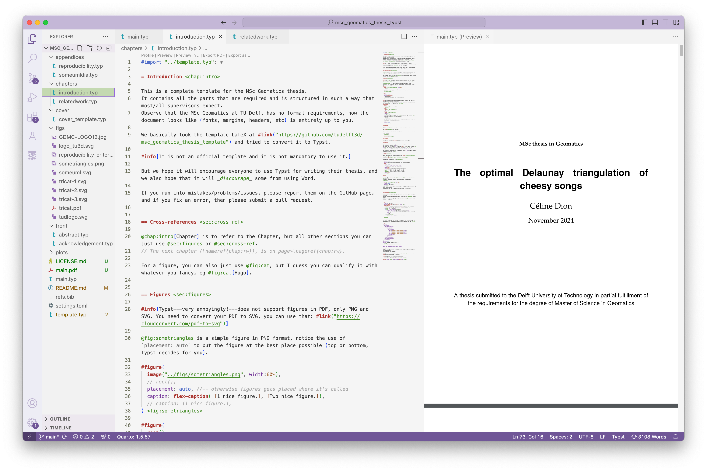

# MSc Geomatics final thesis template (Typst)

A complete [Typst template](https://typst.app/) for the [MSc Geomatics](http://geomatics.tudelft.nl) thesis.

It contains all the parts that are required and is structured in such a way that most/all supervisors expect.
Observe that the MSc Geomatics at TU Delft has no formal requirements, how the document looks like (fonts, margins, headers, etc) is entirely up to you. 

It is basically a port to Typst of the [LaTeX template](https://github.com/tudelft3d/msc_geomatics_thesis_template), but it looks slightly different.

> It is not an official template and it is not mandatory to use it.

But we hope it will encourage everyone to use Typst or LaTeX for writing their thesis, and we also hope that it will *discourage* some from using Word.

## What is Typst?

It's the "new LaTeX": simpler to learn, simpler to modify the layout, 9423.6X faster.
But also, at the moment, has fewer features, can be a bit buggy, the base code changes often (which can break some functions), etc. 

So great to use, but be warned a bit...

## How to use this template?

The file `chapters/introduction.typ` contains several tips that are useful when using Typst, read its source code!

To modify this template:

1. put your details in `settings.toml`
2. `typst compile main.typ`

If you're used to LaTeX, see the handy [Guide for LaTeX users](https://typst.app/docs/guides/guide-for-latex-users/).

## Which software to use?

### Editors

If you want to work locally, then we strongly encourage you to use:

* [VSCode](https://code.visualstudio.com/)
* with the [Tinymist extension](https://marketplace.visualstudio.com/items?itemName=myriad-dreamin.tinymist) (which offers real-time preview/rendering)

The web-application is free, the rending in real-time works great, and it has collaboration tools integrated. The only potential drawback is that not all fonts are present

* [Typst.app](https://typst.app/) 

### Managing references

BibTeX can be used, this is a good cross-platform one:

* [JabRef](http://jabref.sourceforge.net) (cross-platform)

### Drawing figures

The main drawback of Typst at the moment is that figures can only be in SVG and/or PNG... If you use PDF figures in your everyday life (like me), you'll need to convert them to SVG (if you drag a PDF figure to the web-application it automatically converts it).

There is also a new package to use PDF directly (https://github.com/frozolotl/muchpdf) but I don't know its status.

* [IPE](http://ipe.otfried.org/) (cross-platform; integrates LaTeX text; great for triangulation and geometric stuff)
* Adobe Illustrator (nice, but €€€)
* [Inkscape](https://inkscape.org/en/) (cross-platform)

### Drawing flowcharts

* [draw.io](https://www.draw.io/)  